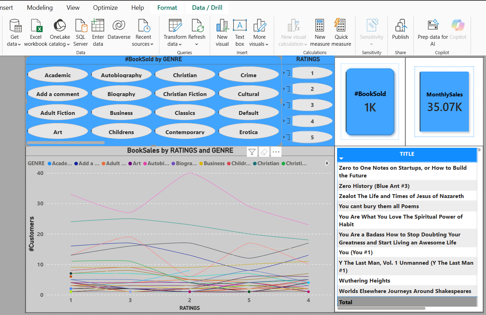

## Overview
This project demonstrates a production-oriented ETL (Extract(REST API), Transform(Python function), Load(Oracle database callable package procedure)) pipeline designed with scalability, maintainability, and automation in mind. The pipeline integrates multiple technologies commonly used in modern data platforms, covering database augmentation, data ingestion, transformation,loading, orchestration,scheduling persistent deployment, and reporting for stakeholders consumption.  The primary objective is to show how raw API data can be reliably transformed into analytics-ready datasets and surfaced through business intelligence tooling e.g PowerBI.  

## Architecture

- **Extract:** Ingest structured data from a third-party REST API

- **Transform:** Apply validation, cleansing, and transformation logic using Python function

- **Load:** Consistently persist data using SQL-based schemas and PL/SQL business logic

- **Orchestrate:** Schedule and automate workflows using Apache Airflow

- **Deploy:** Run Airflow in a Dockerized Linux environment

- **Visualize:** Consume curated datasets in Power BI for analytical reporting

## Tech Stack
**SQL:**  Database schema design, data preparation and integrity enforement [`View logic`](SQL_PLSQL/Ora_Data_modelling.sql)

**PL/SQL:** Database-side business logic ([`Bulk Insert/update procedure`](SQL_PLSQL/Pl_SQL_loading_ora_package.sql) and Triggers-[`data quality and logging`](SQL_PLSQL/Database_Trigger_Book_store.sql)-)

**Python:**   Data ingestion, validation,transformation,batch handling and loading(database callable procedure)logic.[`View logic`](src/source_code.ipynb)

**Apache Airflow:** [`Workflow orchestration`](dags/scripts/project_automate_etl.py),scheduling and automation.[`Dag`](dags/Automate_runtime_etl.py)

**Docker:**   Containerized execution environment for Airflow.

**Power BI** data visualization and KPI reporting.

A complete end-to-end architecture and implementation walkthrough segmented by technology is available on [`Youtube playlist`](https://www.youtube.com/playlist?list=PL2rq7cLwpbdC8y8Eh_Jri3EY6gHFWuc65), covering the Oracle database preparation, ETL flow, orchestration,scheduling and automation logic, Dockerized deployment, and Power BI reporting